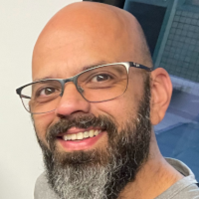

# Hi, I'm Evandro 👋 *Fogueteiro da Holanda* 🇧🇷 🇳🇱

A Brazilian developer living in the Netherlands, fixing Kerbal Space Program mods and launching things that (mostly) don't explode.

The nickname comes from the Brazilian space community on YouTube: every time I join a [SpaceOrbit](https://www.youtube.com/@SpaceOrbit) live chat, I say *"Fogueteiro da Holanda presente!"* ("the rocket guy from Holland is here!"), and the name stuck.

## 🔧 The workshop: KSP mods
Lots of great KSP mods are broken or abandoned. I track down the bug, test the fix in game and send it to the mod's author, and I translate mods to Brazilian Portuguese.

**Merged so far**
- [DeepFreeze Updated](https://github.com/linuxgurugamer/DeepFreezeUpdated): fixes in the freezer window, localization and mod compatibility ([#12](https://github.com/linuxgurugamer/DeepFreezeUpdated/pull/12), [#13](https://github.com/linuxgurugamer/DeepFreezeUpdated/pull/13), [#14](https://github.com/linuxgurugamer/DeepFreezeUpdated/pull/14))
- [Contract Configurator](https://github.com/KSP-RO/ContractConfigurator): Surface Experiment Pack support ([#78](https://github.com/KSP-RO/ContractConfigurator/pull/78), [#79](https://github.com/KSP-RO/ContractConfigurator/pull/79))
- [ScrapYard](https://github.com/zer0Kerbal/ScrapYard) and [Time For Science](https://github.com/Rjoande/TimeForScience): Brazilian Portuguese translations; Time For Science is now on [CKAN](https://github.com/KSP-CKAN/NetKAN/pull/11628)

**My own projects**
- [SEPContracts](https://github.com/celino/SEPContracts): Contract Configurator contracts for the Surface Experiment Pack
- [SEP-KAS1-Patch](https://github.com/celino/SEP-KAS1-Patch): makes the SEP power conduit work with KAS 1.x
- [ksp-moddev](https://github.com/celino/ksp-moddev): Unity 2019.4.18f1 + PartTools for KSP modding in a Docker container, no local install

## 🤖 How I work
I work with an AI intern: Claudinho (Claude, by Anthropic). We plan together and nothing gets built before I approve the plan; he does most of the work and runs the automated checks; I review every change and test it in game, and we go around again until it's right. I'm the one who approves and answers for everything I publish, even when Claudinho did most of the work.

## 🎮 Streams (coming soon)
Co-op games with friends from Europe (in English) and Brazil (in Portuguese), KSP missions and live bug hunts.

## ☕ Support
If my fixes saved your career save, you can [buy me a coffee](https://buymeacoffee.com/fogueteiro_da_holanda). It goes to more time fixing mods and better gear for the streams.

---

🇧🇷 **Em português:** sou brasileiro, moro na Holanda e conserto mods de Kerbal Space Program que estão quebrados ou abandonados, além de traduzir mods para o português. O apelido vem da comunidade do SpaceOrbit: em toda live, eu chego no chat com *"Fogueteiro da Holanda presente!"*. Trabalho com um estagiário de IA, o Claudinho (Claude, da Anthropic), mas eu aprovo o plano, reviso, testo e respondo por tudo o que publico. Se quiser apoiar: [buymeacoffee.com/fogueteiro_da_holanda](https://buymeacoffee.com/fogueteiro_da_holanda).
